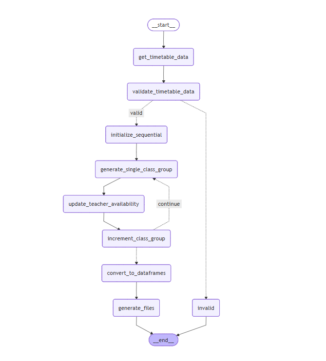

# Skejul AI - School Timetable Generator


An intelligent school timetable generator that uses AI to automatically create optimized class schedules based on natural language input. The system extracts structured data from user requirements and generates comprehensive timetables for class groups sequentially with teacher availability tracking.



## Features

- **Natural Language Processing**: Input timetable requirements in plain English
- **Intelligent Data Extraction**: Automatically extracts school days, periods, subjects, teachers, and constraints
- **Flexible LLM Configuration**: Configure any LLM provider via environment variables (.env file)
- **Sequential Processing**: Generates timetables one class group at a time to prevent teacher conflicts
- **Teacher Availability Tracking**: Prevents double-booking teachers across class groups
- **Structured Validation**: Validates extracted data before timetable generation
- **Beautiful Terminal UI**: Enhanced user experience with Rich library for colorful output
- **DataFrame Export**: Automatic conversion to pandas DataFrames for analysis
- **Multi-Format Output**: Generate PNG images, CSV files, and Excel spreadsheets
- **Flexible Constraints**: Handles teacher preferences, workload limits, and scheduling constraints
- **JSON Output**: Generates structured timetables in JSON format for easy integration
- **Workflow Visualization**: Generate Mermaid diagrams to visualize the workflow

## Usage

### Basic Usage

Run the script with a sample prompt:

```bash
python main.py
```

### Custom Input

Modify the `USER_PROMPT` in `prompts.py` or pass your requirements:

```python
from main import graph

result = graph.invoke({
    "input": """
    Generate a timetable for JSS 1, JSS 2, Primary 5 (Mon-Fri, 7:00 AM-5:00 PM).
    
    Schedule:
    - Assembly: 7:00-8:20 AM
    - Breaks: 9:40-10:00, 11:20-11:35, Lunch: 12:55-2:00
    - Each period: 40 mins
    
    Subjects: English, Math, Science, Social Studies
    Teachers: Mr. A (English), Mr. B (Math), Mrs. C (Science)
    
    Constraints:
    - No teacher overlap across class groups
    - Max 4 periods per teacher per day
    """
})

# Access different outputs
print("JSON Timetables:")
print(result['class_timetables'])

print("\nDataFrame Format:")
for class_name, df in result['class_timetables_df'].items():
    print(f"\n{class_name}:")
    print(df.head())

print("\nGenerated Files:")
for file_path in result['generated_files']:
    print(f"- {file_path}")
```

## Input Format

The system accepts natural language input describing:

### Required Information:
- **School Days**: e.g., "Monday to Friday"
- **School Hours**: e.g., "7:00 AM to 5:00 PM"
- **Class Groups**: e.g., "JSS 1", "Primary 5"
- **Subjects**: List of subjects to be scheduled
- **Teachers**: Teacher names and their subjects

### Optional Information:
- **Fixed Periods**: Assembly, breaks, lunch times
- **Period Duration**: e.g., "40 minutes per period"
- **Teacher Constraints**: Preferences, maximum periods per day
- **Special Activities**: Sports, prayers, etc.

## Output Format

The system generates multiple output formats:

### 1. JSON Timetables
Structured JSON format for programmatic use:

```json
{
  "JSS 1": {
    "Monday": [
      {
        "period_no": 1,
        "start": "07:00 AM",
        "end": "08:20 AM",
        "type": "assembly",
        "subject": null
      },
      {
        "period_no": 2,
        "start": "08:20 AM",
        "end": "09:00 AM",
        "type": "class",
        "subject": {
          "name": "Math",
          "teacher_name": "Mr. C"
        }
      }
    ]
  }
}
```

### 3. Generated Files

## Sample Timetables

Here are a couple of sample timetable images created by the project. These demonstrate the PNG output format and the visual style used for generated timetables.


_*JSS 1 sample timetable (auto-generated and saved to `generated_timetables/`).*_


_*Example colored timetable from the `timetable samples/` folder.*
Automatic generation of multiple file formats in the `generated_timetables/` directory:
- **PNG Images**: Visual timetable representations (e.g., `JSS_1_timetable.png`)
- **CSV Files**: Comma-separated values for spreadsheet import (e.g., `JSS_1_timetable.csv`)
- **Excel Files**: Native Excel format with proper formatting (e.g., `JSS_1_timetable.xlsx`)

All files are automatically generated and saved with safe filenames.

## Workflow

The system uses a LangGraph workflow with sequential class group processing:

1. **Data Extraction**: Extracts structured data from natural language input using structured LLM
2. **Validation**: Validates that all required information is present with visual status display
3. **Sequential Processing Initialization**: Sets up processing for multiple class groups
4. **For Each Class Group**:
   - **Generate Single Class Group**: Creates timetable for current class group only
   - **Update Teacher Availability**: Tracks when teachers are busy from previous class groups
   - **Increment Index**: Moves to next class group
5. **DataFrame Conversion**: Converts all timetables to structured pandas DataFrames
6. **File Generation**: Automatically generates PNG, CSV, and Excel files
7. **Output**: Returns JSON timetables, DataFrames, and file paths

This sequential approach ensures no teacher conflicts across different class groups while providing multiple output formats for different use cases.

## Configuration

### LLM Models
Configure AI models flexibly via `.env` file:

```env
# Structured data extraction LLM
STRUCTURED_LLM_PROVIDER=google_genai
STRUCTURED_LLM_MODEL=gemini-2.5-flash
STRUCTURED_LLM_TEMPERATURE=0

# Timetable generation LLM  
LLM_PROVIDER=groq
LLM_MODEL=moonshotai/kimi-k2-instruct
LLM_TEMPERATURE=0.1
```

Supported providers:
- `google_genai`: Google Gemini models
- `groq`: Groq models including Moonshot AI
- `openai`: OpenAI models (via LangChain)
- Any LangChain-compatible provider

### Prompts
Customize the AI prompts in `prompts.py`:
- `GET_TIMETABLE_SYSTEM_PROMPT`: For structured data extraction
- `GENERATE_SINGLE_GRADE_PROMPT`: For single class group timetable generation

## Data Models

The system uses Pydantic models for type safety:

- **TimetableData**: Main data structure for extracted information
- **ClassGroup**: Represents a class with subjects and teachers
- **TimePeriod**: Represents time slots and their types
- **SubjectDefinition**: Subject details with teacher assignments

## Error Handling

The system includes validation for:
- Missing required data (school days, periods, class groups)
- Invalid time formats
- Teacher scheduling conflicts across class groups
- Incomplete subject-teacher assignments
- Sequential processing ensures teacher availability tracking

## License

This project is licensed under the MIT License - see the LICENSE file for details.

## Support

For issues and questions:
- Create an issue on GitHub
- Check existing documentation
- Review the example prompts in `prompts.py`

## Example Use Cases

- **Primary Schools**: Generate visual timetables for elementary classes with simple subjects
- **Secondary Schools**: Handle complex subject-teacher assignments with constraint tracking
- **Private Schools**: Accommodate special schedules, assembly times, and unique constraints
- **Tutoring Centers**: Organize multiple classes and instructors across different time slots
- **International Schools**: Manage diverse curriculum requirements and teacher availability
- **Homeschool Groups**: Create structured schedules for co-op classes and shared resources

## Dependencies

Key dependencies include:
- **LangChain & LangGraph**: AI workflow orchestration
- **Pandas**: Data manipulation and DataFrame operations
- **Rich**: Beautiful terminal UI with colors, tables, and progress bars
- **Matplotlib**: Timetable image generation
- **Pydantic**: Data validation and type safety
- **OpenPyXL**: Excel file generation
- **Python-dotenv**: Environment variable management

Install all dependencies:
```bash
pip install -r requirements.txt
```

## File Structure

```
skejul-ai/
├── main.py                    # Main application entry point
├── models.py                  # Pydantic data models
├── prompts.py                 # AI prompts and configurations
├── utils.py                   # Utility functions
├── niceterminalui.py          # Terminal UI components
├── create_timetable_image.py  # Image generation functions
├── resources/                 # Project images and assets
│   ├── skejul-ai.png         # Project logo
│   └── workflow.png          # Workflow diagram
├── generated_timetables/      # Output directory (auto-created)
├── requirements.txt           # Python dependencies
└── README.md                  # This file
```
